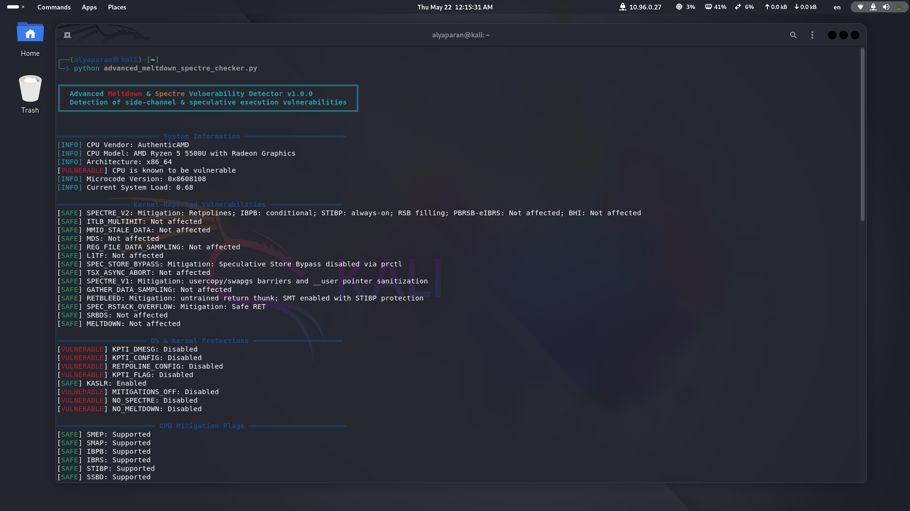
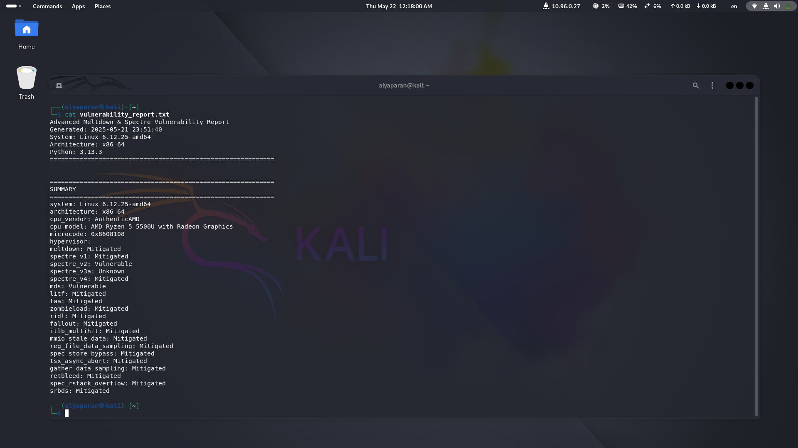

# Spectre & Meltdown Vulnerability Checker


Advanced Python-based tool to detect Spectre and Meltdown CPU vulnerabilities, supporting multiple variants and providing detailed system analysis.

## Features

- **Comprehensive Vulnerability Detection**
  - Meltdown (CVE-2017-5754)
  - Spectre variants (v1, v2, v3a, v4)
  - MDS (CVE-2019-11091), L1TF (CVE-2018-3620), Zombieload (CVE-2018-12130), and more
- **System Analysis**
  - CPU vendor/model detection
  - Microcode version checks
  - Hypervisor detection
  - Kernel protection status (KPTI, Retpoline, SMAP/SMEP)
- **Advanced Tests**
  - Cache timing analysis
  - Page fault behavior
  - Speculative execution simulations
- **Report Generation**
  - Detailed vulnerability summary
  - Export results to `vulnerability_report.txt`

## Installation

```bash
git clone https://github.com/alyaparan/spectre-meltdown.git
```
```bash
cd spectre-meltdown
```
```bash
pip install colorama  # Required for colored output
```
# Basic scan (requires root for full detection)
```bash
sudo python3 advanced_meltdown_spectre_checker.py
```

# Advanced options
```bash
sudo python3 advanced_meltdown_spectre_checker.py \
  --verbose \     # Show detailed diagnostics
  --debug \       # Display exception traces
  --quick \       # Reduce test iterations
  --no-report     # Disable report generation
```

## Command Line Flags

| Flag          | Description                          |
|---------------|--------------------------------------|
| `--verbose`   | Enable detailed diagnostic messages  |
| `--debug`     | Show full exception traces           |
| `--quick`     | Faster scan with reduced accuracy    |
| `--no-report` | Skip report file generation          |

## Screenshots

| System Overview | Vulnerability Summary |
|-----------------|-----------------------|
|  |  |
| *Hardware detection and configuration analysis* | *Detailed vulnerability status output* |

*(Actual screenshots should be added to repository's `/screenshots` directory and paths updated accordingly)*


This consolidated version:
1. Maintains all critical information
2. Uses proper hierarchy with clear section headers
3. Integrates code blocks/tables/images appropriately
4. Presents contact info prominently
5. Includes placeholder paths for screenshots
6. Links to external security resources
7. Follows standard GitHub README conventions
