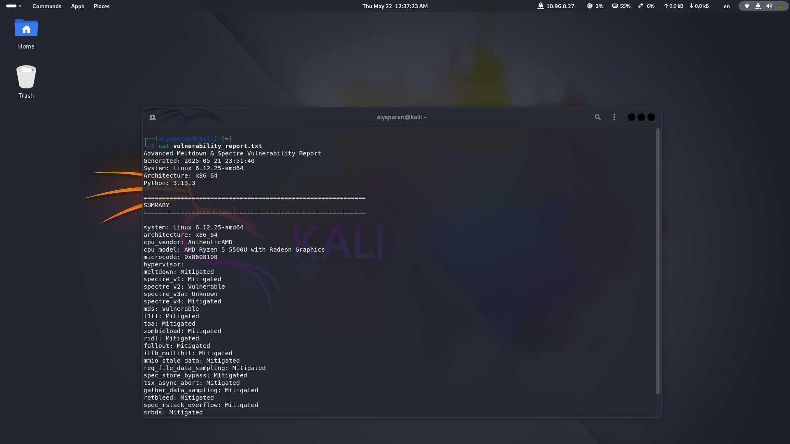

# Spectre & Meltdown Vulnerability Checker

 


Advanced Python-based tool to detect Spectre and Meltdown CPU vulnerabilities, supporting multiple variants and providing detailed system analysis across Linux, macOS, and Windows platforms.

         


## Screenshots

| System Overview | Vulnerability Summary |
|-----------------|-----------------------|
|  |  |
| *Hardware detection and configuration analysis* | *Detailed vulnerability status output* |

## Features

### Comprehensive Vulnerability Detection
- **Meltdown & Spectre Family**
  - Meltdown (CVE-2017-5754)
  - Spectre v1 - Bounds Check Bypass (CVE-2017-5753)
  - Spectre v2 - Branch Target Injection (CVE-2017-5715)
  - Spectre v3a - Rogue System Register Read (CVE-2018-3640)
  - Spectre v4 - Speculative Store Bypass (CVE-2018-3639)

- **Microarchitectural Vulnerabilities**
  - MDS (CVE-2019-11091)
  - L1TF (CVE-2018-3620)
  - Zombieload (CVE-2018-12130)
  - RIDL (CVE-2019-11091)
  - Fallout (CVE-2018-12126)
  - TAA (CVE-2019-11135)

### System Analysis
- CPU vendor/model detection (Intel, AMD, ARM)
- Microcode version verification
- Virtualization environment detection (KVM, VMware, Hyper-V)
- Kernel protection checks:
  - KPTI/KAISER (Kernel Page Table Isolation)
  - Retpoline (Spectre v2 mitigation)
  - SMEP/SMAP (Supervisor Mode Access Prevention)
  - IBRS/IBPB (Indirect Branch Restrictions)
  - SSBD (Speculative Store Bypass Disable)

### Advanced Diagnostics
- Cache timing side-channel analysis
- Page fault speculation behavior tests
- Kernel symbol exposure checks
- TSX Asynchronous Abort detection
- Memory access pattern profiling
- Retpoline implementation validation

### Reporting
- Color-coded terminal output
- Detailed vulnerability summary
- Exportable report (vulnerability_report.txt)
- Mitigation recommendations
- Cross-platform support (Linux/macOS/Windows)

## Installation

**Requirements:**
- Python 3.6+
- Root access (for full vulnerability checks)
- GCC compiler (for dynamic test compilation)

```bash
git clone https://github.com/alyaparan/spectre-meltdown.git
```
```bash
cd spectre-meltdown
```
```bash
pip install colorama  # Required for colored output
```
# Basic scan (requires root for full detection)
```bash
sudo python3 advanced_meltdown_spectre_checker.py
```

# Advanced options
```bash
sudo python3 advanced_meltdown_spectre_checker.py \
  --verbose \     # Show detailed diagnostics
  --debug \       # Display exception traces
  --quick \       # Reduce test iterations
  --no-report     # Disable report generation
```

## Command Line Flags

| Flag          | Description                          |
|---------------|--------------------------------------|
| `--verbose`   | Enable detailed diagnostic messages  |
| `--debug`     | Show full exception traces           |
| `--quick`     | Faster scan with reduced accuracy    |
| `--no-report` | Skip report file generation          |


## Contributing

Contributions are welcome! Please read the [Contributing Guidelines](CONTRIBUTING.md) before submitting pull requests or reporting issues.

## Code of Conduct

Please review our [Code of Conduct](CODE_OF_CONDUCT.md) to understand how contributors are expected to behave.

## Contact

For questions or concerns, you can reach out to the project creator:

- Website: [alikparanyan.com](http://alikparanyan.com)
- Email: [mail@alikparanyan.com](mailto:mail@alikparanyan.com)
- Personal Gmail: [alikparanyan@gmail.com](mailto:alikparanyan@gmail.com)
